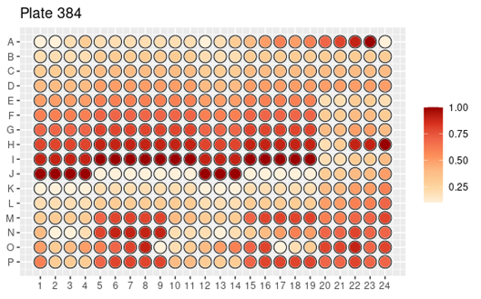
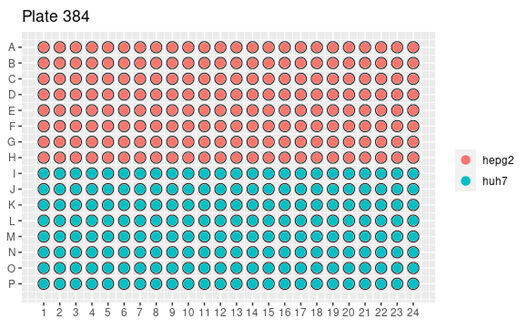

# Summary

  Experimental techniques that acquire data from multi-well plates are very common in life science research; today they account for half of all assays used in drug development and toxicity testing. These experiments include colorimetric, fluorometric and luminometric assays for cytotoxicity / cell viability [@Sittampalam:2004], bacterial assays [@Burton:2007; @Pant:2016] and immunoassays [@Lin:2015; @Song:2015]. Such assays feature in small-scale experiments and also in high-throughput screens. high-throughput imaging and spectrofluorometric quantification-based methods are increasingly used in the pharmaceutical industry and in academic research aiming to screen large libraries (e.g. potential drug compounds, RNAi, CRISPR/Cas9) or to quantify rare biological events.

Plate-reading equipment is usually supplied with accompanying analytic software, such as  Gen5 (BioTek), Multi-Mode Analysis Software (Molecular Devices), and Multiwell-Analyzer (Multi Channel Systems). There are, however, drawbacks to its use. Usually, the software is bound to the data coming from a specific piece of equipment, it is seldom possible to us the software on multiple computers without making additional license purchases. This is a problem in academic settings in which a single machine is shared and used intensively by several research groups. Also, proprietary software has closed code that cannot be checked or understood in detail by the  user and cannot be expanded or adapted for analyses not envisaged by the equipment manufacturer.

In response to these limitations, some open-source software packages have been developed to server particular unusual applications such as single-cell migration [@Masuzzo:2017] or differential scanning fluorimetry [@Wang:2012]. Open software with more general capabilities like DRfit [@Hofmann:2019] that run on JAVA platforms has been developed, but they are not ideal for high throughput screening. They are also limited to the options provided by the software, unless a user is willing to write additional JAVA code, a skill not particularly common among cell biologists. Many biologists are familiar with the statistical language, R, and R libraries have been created to assist with analysis of data from plate readers. Examples include ‘platetools’ (https://cran.r-project.org/package=platetools), ‘plater’ (https://cran.r-project.org/package=plater) and ‘phenoScreen’ (https://rpubs.com/Swarchal/phenoScreen), each of which addresses particular functions. ‘Plater’, for example, is focused on data formatting, ‘phenoScreen’ on data visualization, and ‘platetools’ on both data visualizing and formatting. The packages are useful, but can be difficult for a beginner to grasp, partly because their documentation seems not to have been written with beginners in mind.

Here, we introduce a new open-source package, 'bioassays', designed to provide a wide range of functions relevant to multi-well plate assays. ‘Bioassays’ is an R package freely available on CRAN [@R:2014], and has supports for formatting, visualizing and analyzing multi-well plate assays. It has functions for handling outliers, for handling multiple data sets with separate blanks, for estimating values from standard curves, for summarizing data and for doing statistical analysis. Moreover, it is strongly documented in a manner designed to be easy for even beginners to grasp. Because this is a R package, more experienced users will be able add to its functionality using other R packages.

# Bioassays
Bioassays can handle data from any of the standard multi-well plate format: 6, 12, 24, 96 or 384 well plates. A prerequisite for the package is the need for both input data (\autoref{figure 1}) and metadata (\autoref{figure 2}) to be in comma-separated variable (csv) format; most plate readers can expert data as a .csv file. Metadata need  “row” and “col” columns to indicate the location of well.  The package has functions for data extraction (extract_filename), formatting (data2plateformat, plate2df, matrix96 and plate_metadata), visualization (heatplate) and data analysis (reduceblank, estimate, dfsummary, pvalue).

The function extract_filename is useful for extracting specific information from file names, such as compound name, plate number etc., which can be used for automated data analysis. Since even the most naive computer users know how to change the names of files, this provides a very simple way to pass data of this type into the analysis.

The function data2plateformatconvert converts the data (eg: readings from a 96 well plate) to an appropriate matrix format with suitable row and column names. The plate2df function can convert such data into a data frame with ‘row’ and ‘col’ columns to indicate well position. The function matrix96 can convert both character and numeric columns to a matrix. This function can automatically determine the type of multi-well from which the data is coming, and it have provision to convert negative and NA values to 0, if needed. The plate_metadata function combines plate-specific information (such as compound used, standard concentration, dilution of samples, etc.), to produce unique plate metadata.

For data visualization, the ‘heatplate’ function can be used. This can plot both heat plots (\autoref{figure 3}) and categorical plots (\autoref{figure 4}) automatically, depending on the data type.  The ‘heatplate’ function also has provisions for adjusting the displayed well size, for visual esthetics.

The function ‘reduceblank’ can help to reduce blank values from the readings. This function can handle separate blanks for different datasets. The function ‘estimate’ can be used to estimate unknown variable (eg: concentration) based on standard curve. The function ‘dfsummary’ is really versatile for handling multiple data sets. It can group samples and summarize data sets separately. It has additional controls for handling outliers and omitting unwanted data sets. Function ‘pvalue’ can be used to test significance by t-test. It has provisions for asserting control group and level of significance.

# Availability and installation

Bioassays is supported on Windows and macOS. The package can be installed using install.packages command in R. The source code, vignette, datasets and detailed examples on how to use the package are available on CRAN ( https://CRAN.R-project.org/package=bioassays) and GitHub (https://github.com/anwarbio/bioassays).

# Acknowledgment
The author acknowledges Prof Jamie Davies for suggestions and correcting the article. Support from lab members are acknolegment.

# Figures

# References
